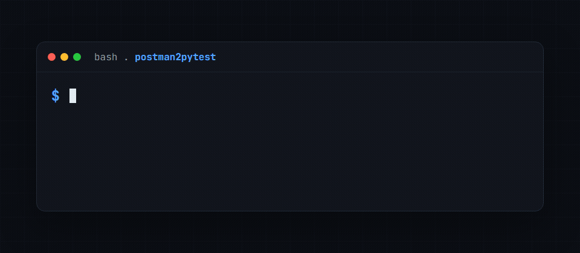

# postman2pytest

[](https://github.com/golikovichev/postman2pytest/actions/workflows/ci.yml)
[](https://github.com/golikovichev/postman2pytest/actions/workflows/codeql.yml)
[](https://codecov.io/gh/golikovichev/postman2pytest)
[](https://pypi.org/project/postman2pytest/)
[](https://pepy.tech/project/postman2pytest)
[](https://pepy.tech/project/postman2pytest)
[](https://pypi.org/project/postman2pytest/)
[](LICENSE)
[](https://github.com/golikovichev/postman2pytest/commits/main)
[](https://www.bestpractices.dev/projects/13008)
[](https://tessl.io/registry/golikovichev/postman2pytest)

Convert a **Postman Collection v2.1** JSON file into a ready-to-run **pytest** test suite. One command.



📖 **[Read the article on Dev.to](https://dev.to/golikovichev/postman-and-pytest-are-living-in-parallel-universes-heres-a-bridge-5bgn)**

```bash
postman2pytest --collection my_api.json --out tests/test_api.py
BASE_URL=https://api.example.com pytest tests/test_api.py -v
```

## Why

Postman collections document your API. `postman2pytest` turns that documentation into executable regression tests that run in CI. No manual rewriting, no drift.

## Install

```bash
pip install postman2pytest
```

Or from source:

```bash
git clone https://github.com/golikovichev/postman2pytest
cd postman2pytest
pip install -e .
```

## Usage

```bash
postman2pytest \
  --collection data/my_api.postman_collection.json \
  --out generated_tests/test_api.py
```

Then run the generated tests:

```bash
BASE_URL=https://staging.example.com pytest generated_tests/test_api.py -v
```

### Options

| Flag | Required | Description |
|------|----------|-------------|
| `--collection` | ✅ | Path to the input file: a Postman Collection v2.1 JSON, or an OpenAPI 3.x spec with `--input-format openapi` |
| `--out` | ✅ | Output path for generated pytest file |
| `--input-format` | ❌ | `postman` (default) or `openapi` (OpenAPI 3.x JSON or YAML) |
| `--base-url` | ❌ | Tip printed after generation (does not override env var) |
| `--filter-folder` | ❌ | Generate tests only for the named Postman folder |
| `--env` | ❌ | Postman environment JSON export to resolve `{{variables}}` |
| `--max-input-mb` | ❌ | Refuse to load collections larger than this many MB (default: 100) |

### OpenAPI 3.x input

If your API is documented as an OpenAPI 3.x spec instead of a Postman
collection, pass `--input-format openapi`. JSON and YAML specs are both
accepted:

```bash
postman2pytest \
  --collection openapi/my_api.yaml \
  --input-format openapi \
  --out generated_tests/test_api.py
```

The generated suite has the same shape as the Postman path. Path parameters
(`/users/{id}`), query parameters, and header parameters map to `os.environ`
lookups, and a JSON request body is generated from the operation's example or
schema. Operations are grouped by their first tag (used as the folder name), so
`--filter-folder` works the same way.

Notes for this first version: the base URL always comes from the `BASE_URL`
environment variable, so any path in the spec's `servers` list is ignored (put
the version prefix in `BASE_URL`). `$ref` references are not resolved, so a
request body defined purely by a `$ref` is generated empty.

To regenerate tests for one folder, pass its Postman folder name:

```bash
postman2pytest \
  --collection data/my_api.postman_collection.json \
  --out generated_tests/test_users.py \
  --filter-folder Users
```

### Resolving environment variables

Postman collections reference variables such as `{{base_url}}` and
`{{auth_token}}`. Pass a Postman environment export with `--env` to resolve
them:

```bash
postman2pytest \
  --collection data/my_api.postman_collection.json \
  --out generated_tests/test_api.py \
  --env data/prod.postman_environment.json
```

- Non-secret variables are inlined as literal values in the generated tests.
- Variables marked `secret` in the environment, and any variable not present
  in it, become named pytest fixtures instead. The secret value never lands in
  the generated source; the fixture reads it from the environment at run time
  (and can be overridden in your own `conftest.py`).

Resolution covers variables in request URLs and headers. Variables inside
request bodies and form fields are not resolved yet and are left as-is.

Without `--env`, variables are left as `os.environ.get("name", "")` lookups,
exactly as before.

## Examples

### Generate tests for a single folder

The bundled `data/sample_collection.json` file includes a `Users` folder and one top-level `Health check` request. Generating from the whole collection creates three tests:

```bash
postman2pytest \
  --collection data/sample_collection.json \
  --out /tmp/test_all.py
```

```text
Generated 3 test(s) -> /tmp/test_all.py
```

The generated file contains tests with folder-prefixed names:

```python
def test_users_get_get_all_users():
def test_users_post_create_user():
def test_get_health_check():
```

To generate only the requests from the `Users` folder, pass `--filter-folder`. Folder matching is case-insensitive, so `Users`, `users`, and `USERS` all match the same folder:

```bash
postman2pytest \
  --collection data/sample_collection.json \
  --out /tmp/test_users.py \
  --filter-folder Users
```

```text
Generated 2 test(s) -> /tmp/test_users.py
```

The filtered output contains only the tests from that folder:

```python
def test_users_get_get_all_users():
def test_users_post_create_user():
```

## How It Works

1. **Parse**: reads the Postman Collection JSON, flattens nested folders into a flat request list
2. **Extract**: captures method, URL, headers, body, and expected status from `pm.response.to.have.status()` test scripts
3. **Generate**: renders a Jinja2 template into a `.py` file with one `def test_*()` per request

### Variable substitution

Postman variables `{{base_url}}` become `ENV_base_url` in the URL, resolved at runtime via the `BASE_URL` environment variable.

## Generated output example

Given a Postman request `GET {{base_url}}/api/v1/users` with a test asserting status 200, the output is:

```python
def test_get_users():
    """GET ENV_base_url/api/v1/users"""
    url = f"{BASE_URL}/api/v1/users"
    headers = {}
    response = requests.get(url, headers=headers)
    assert response.status_code == 200, (
        f"Expected 200, got {response.status_code}: {response.text[:200]}"
    )
```

## Supported features

- ✅ Postman Collection v2.1 (v2.0 accepted with a warning)
- ✅ Nested folders → flattened with folder prefix in test name
- ✅ GET, POST, PUT, DELETE, PATCH, HEAD, OPTIONS
- ✅ Request headers (disabled headers excluded)
- ✅ Auth headers (Authorization Bearer/Basic, API-key headers) pulled into a
  shared `auth_headers` fixture in a generated `conftest.py`; the secret is
  replaced with an environment-variable placeholder (`AUTH_TOKEN`, `X_API_KEY`, ...)
- ✅ Raw JSON body
- ✅ Expected status from `pm.response.to.have.status(N)` test scripts
- ✅ Falls back to 200 when no status assertion found
- ✅ Test-script assertions translated to pytest `assert`: response time
  (`responseTime ... to.be.below(N)`), header presence (`to.have.header("X")`),
  and top-level JSON field equality (`pm.expect(jsonData.field).to.eql(value)`,
  string / number / boolean)
- ✅ Malformed items skipped with a warning. Rest of collection still generated

## Limitations

Honest scope so you know what to expect before pointing the tool at a real
collection.

- **Postman environments need `--env`.** Without it, `{{baseUrl}}` and friends
  pass through verbatim into the generated `url` strings, so set the `BASE_URL`
  env var at test time or post-process the file. Pass `--env path/to/env.json`
  to resolve them: non-secret values are inlined as literals, secret and
  unknown variables stay as `os.environ` lookups.
- ❌ **Pre-request scripts are skipped.** Auth that depends on `pm.sendRequest`
  to grab a token before each call (e.g. OAuth client-credentials flows
  refreshing per request) needs manual translation into a pytest fixture.
- ⚠ **Only a subset of test-script assertions is translated.** Status,
  response time, header presence, and top-level JSON field equality survive the
  conversion (see Supported features). Anything outside that subset (arbitrary
  JS, nested-field or array-length checks, JSON schema validation, and
  `pm.variables.set(...)` calls) is skipped rather than mistranslated, so a
  generated test never carries a broken assert.
- ⚠ **Multipart file uploads are not generated yet.** Text fields in
  `urlencoded` and `formdata` bodies are now rendered as a `data={...}`
  argument on the request. File-type form fields (uploads) are still skipped.
  Tracked in
  [issue #1](https://github.com/golikovichev/postman2pytest/issues/1).
- ⚠ **Form bodies render as `data=` (urlencoded).** Repeated form keys collapse
  to the last value, and a hand-set `multipart/form-data` Content-Type header
  will not match the urlencoded body. Adjust by hand if your endpoint needs
  multipart or multi-value keys.
- ⚠ **`auth_headers` is a union across the collection.** Every detected auth
  header goes into one shared fixture, so a request that used a single scheme
  still receives all of them. Split the fixture by hand if your endpoints use
  conflicting auth. The generated `conftest.py` is overwritten on each run and
  is not merged with an existing one.
- ❌ **Cookies, certificates, and per-request proxy settings are ignored.**
- ⚠ **Variable substitution is shallow.** Path variables (`/users/:id`)
  become `{id}` placeholders; collection-level variables are not resolved.
- ⚠ **Generated `BASE_URL` defaults to an empty string.** Tests that hit a
  full URL in the Postman item still resolve, but bare path items will fail
  until the env var is set.

If a missing feature is blocking you, please open an issue with a redacted
slice of the collection that demonstrates it.

## Roadmap

Short list of what is next, roughly in priority order. Tracked in detail on
the [issues board](https://github.com/golikovichev/postman2pytest/issues).

- **Multipart file upload support**: `urlencoded` and `formdata` text fields
  now render as `data={...}` (OAuth-token-endpoint cases work). File-type
  upload fields are still skipped.
  ([#1](https://github.com/golikovichev/postman2pytest/issues/1))
- **Auth-header fixtures**
  ([#2](https://github.com/golikovichev/postman2pytest/issues/2)): done. Auth
  headers now extract into a shared `auth_headers` fixture (see Supported
  features).
- **Pre-request script translation, scoped scope**: surface the script,
  even as a `pytest.fixture` stub, so the operator does not lose the auth
  context silently.
- **`--ai-edges` mode**: opt-in pass that asks an LLM to fill in edge
  cases (boundary numbers, missing required fields, type-confusion payloads)
  on top of the deterministic happy-path tests.
- **Allure step annotations toggle**: `--allure` flag that wraps each
  generated test in `allure.step(...)` blocks so the report shows the
  Postman folder structure.

Contributions to any of the above are welcome. See
[CONTRIBUTING.md](CONTRIBUTING.md) for the workflow.

## Running tests

```bash
pip install pytest
pytest tests/ -v
```

## Related projects and patterns

Once `postman2pytest` has generated your suite, the next questions are
usually "how do I structure fixtures across all these requests" and
"how do I run them under async with shared auth state". The
[tessl-labs/pytest-api-testing](https://tessl.io/registry/tessl-labs/pytest-api-testing)
skill on the Tessl Registry collects the conventions that worked for
that follow-on layer: httpx `AsyncClient` setup, `conftest.py` fixture
shape, database isolation, parametrize patterns for edge cases, and
auth-flow handling. Useful reference if your generated tests grow
beyond the request-by-request shape this tool emits.

Sister projects in the same workspace:

- [secure-log2test](https://github.com/golikovichev/secure-log2test): same idea but the input is Kibana / Elasticsearch JSON logs instead of Postman collections.
- [pytest-conversational](https://github.com/golikovichev/pytest-conversational): pytest plugin for multi-turn dialogue testing.
- [phoenix2pytest](https://github.com/golikovichev/phoenix2pytest): same idea but the input is labeled LLM failure traces from Arize Phoenix instead of Postman collections.

## Contributing

Contributions are welcome. If you are new to the project, the issues labelled [good first issue](https://github.com/golikovichev/postman2pytest/labels/good%20first%20issue) and [help wanted](https://github.com/golikovichev/postman2pytest/labels/help%20wanted) are a good place to start. See [CONTRIBUTING.md](CONTRIBUTING.md) for setup and the workflow.

## Changelog

See [CHANGELOG.md](CHANGELOG.md) for release notes.

## License

MIT. See [LICENSE](LICENSE).
